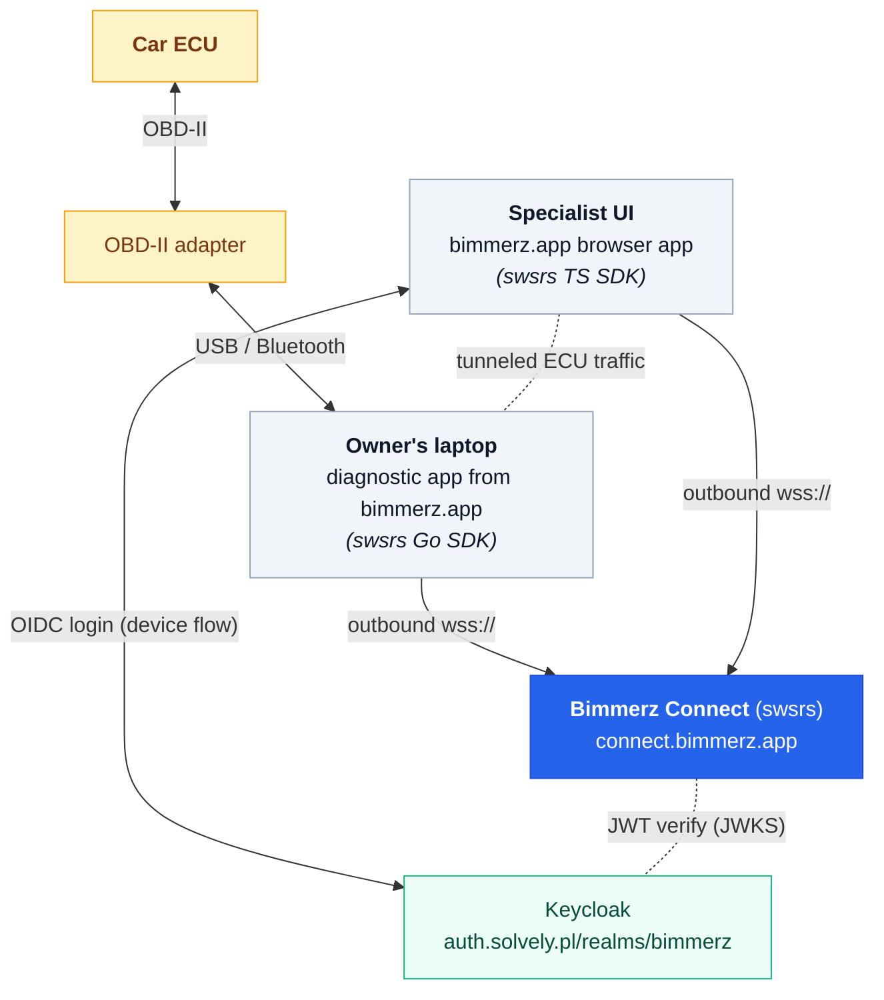

# Bimmerz Connect

**Product:** [bimmerz.app](https://bimmerz.app) — a suite of apps for
BMW owners and technicians.
**Relay deployment:** [connect.bimmerz.app](https://connect.bimmerz.app) — a single-instance
self-hosted swsrs.
**Status:** in production.

## The problem

BMW diagnostics and coding usually means "plug a tool into the OBD-II
port and run software against the car's bus." Owners doing this at home
have a laptop, an OBD-II adapter, and one of the bimmerz.app apps.
What they often **don't** have is the experience to interpret the
results — fault codes, adaptation values, ECU coding maps.

The natural solution is to hand the live diagnostic session to someone
more experienced. The not-natural part is the network: the owner's
laptop sits behind a home router, the experienced user is somewhere
else entirely, and neither party wants to install OpenVPN or open
ports.

## The shape

The exact pattern swsrs is built for:

- **Customer side:** the owner runs an app from the bimmerz.app suite.
  The app embeds the swsrs Go SDK, talks to the car's ECU over OBD-II,
  and opens an outbound WebSocket to Bimmerz Connect when the owner
  starts a session.
- **Operator side:** the experienced user opens a web UI from
  bimmerz.app. The UI uses the swsrs TypeScript SDK to connect as the
  initiator. They see the live car data, read fault codes, apply
  coding changes — all happening on the owner's actual car, in real
  time, through the browser.
- **Rendezvous:** Bimmerz Connect (swsrs) brokers the two ends. It
  sees ciphertext-equivalent bytes; the ECU protocol is between the
  two app halves.

## Why swsrs

A few things lined up:

1. **The owner doesn't need an IdP identity.** This is the canonical
   reason for swsrs's two-plane auth split. The owner runs an app and
   clicks a button; the app gets a session token; the operator (who
   *does* have a Keycloak identity) authenticates separately. The
   owner is never asked to "log in to anything" beyond their existing
   bimmerz.app account.

2. **Same SDK in two very different runtimes.** The diagnostic head
   app is a Go binary on Windows / macOS / Linux. The operator UI is
   a web app in a browser. Both link the swsrs SDK and speak the same
   wire protocol with zero glue.

3. **The data path stays Bimmerz's.** ECU data — fault codes, VINs,
   adaptation maps — never leaves infrastructure Bimmerz controls.
   That's not negotiable when you're touching someone's car. The
   relay itself runs on a small EC2 instance behind Cloudflare.

4. **Tiny operational surface.** Bimmerz Connect is one ~7 MB binary,
   deployed as a Docker image. Cost is measured in dollars per month.
   Operationally it's a non-event.

5. **Open extension path.** New ECU protocols, new app variants, new
   operator tools — all of them are SDK consumers. The relay doesn't
   need releases to support new flows.

## Auth setup

The Bimmerz Connect deployment uses Keycloak as the IdP, configured
per the [Keycloak guide](/guide/idp/keycloak):

| Setting | Value |
|---|---|
| Issuer       | `https://auth.solvely.pl/realms/bimmerz` |
| Audience     | `swsrs` |
| Client ID    | `swsrs` (single public client; device-flow enabled) |
| Scopes       | `swsrs:session:create`, `swsrs:session:read`, `swsrs:session:delete` |

Specialists (the operator side) have their accounts in the Keycloak
realm with `swsrs:session:create` granted via a role. Owners (the
customer side) never touch Keycloak — they're authenticated against
their bimmerz.app account, and the bimmerz.app backend mints sessions
on their behalf.

## Result

Owners get help with their car without learning anything about
networking, VPNs, or screen-sharing. Specialists get a live view into
the actual car on the actual driveway from their browser. swsrs
disappears into the product — neither side knows or cares that there's
a relay involved.

## Got a case study?

If you're using swsrs in production and want it featured here, open an
issue at [github.com/emdzej/swsrs](https://github.com/emdzej/swsrs/issues)
with a short description of the deployment.
