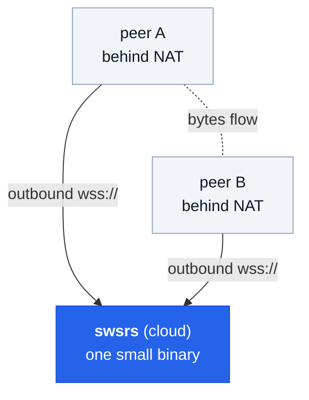

# What is swsrs?

A minimal, self-hostable WebSocket relay that lets two parties behind NAT
or firewalls communicate through a single bidirectional tunnel. Similar
in spirit to [wstunnel](https://github.com/erebe/wstunnel), but with
orchestrated sessions and a clean separation between the admin plane
(OIDC-protected) and the data plane (opaque per-slot tokens).

## When to use it

- **Diagnostic probe ↔ UI** — a backend service on a customer machine
  needs to be reachable from a support engineer's browser, but you don't
  want a VPN.
- **Webhooks-to-local-dev** — bridge a public webhook into a developer
  laptop without exposing a port.
- **Mobile-to-mobile rendezvous** — two phones behind separate NATs,
  brokered by your cloud.

The relay does **one thing**: it carries opaque bytes between two
authenticated peers of one session. Anything you put on the wire is fine —
TCP, UDP, gRPC, SSH, raw frames.

## What's in the box

| Artifact | Purpose |
|---|---|
| `swsrs` binary | Relay server + CLI client subcommands (`auth`, `create`, `tcp-listen`, `tcp-dial`, `raw`) |
| `ghcr.io/emdzej/swsrs` | Multi-arch Docker image (linux/amd64, linux/arm64) |
| `github.com/emdzej/swsrs/pkg/client` | Go SDK — embed peer + admin clients in your Go app |
| `@emdzej/swsrs-client` | TypeScript SDK — browser + Node 22+ |

## Next

- [Quickstart](/guide/quickstart) — get a relay running and a session open in 3 minutes.
- [Architecture](/guide/architecture) — the auth split, session lifecycle, why each decision.
- [Authentication](/guide/auth) — scopes, device flow, --no-auth, audience.
