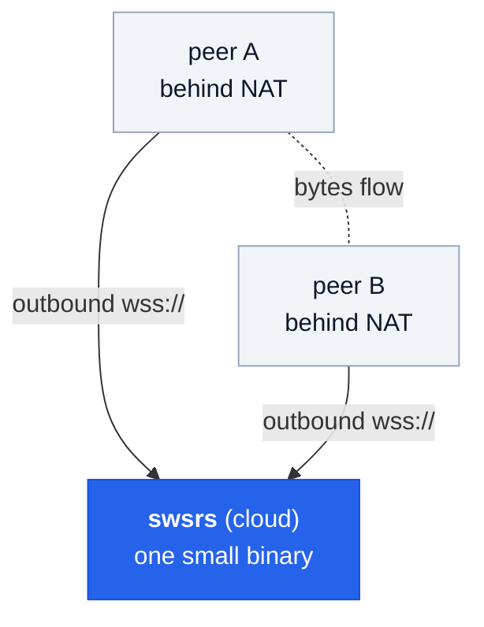

# What is swsrs?

A minimal, self-hostable WebSocket relay that lets two parties behind NAT
or firewalls communicate through a single bidirectional tunnel. Similar
in spirit to [wstunnel](https://github.com/erebe/wstunnel), but with
orchestrated sessions and a clean separation between the admin plane
(OIDC-protected) and the data plane (opaque per-slot tokens).

## When to use it

The shape swsrs is built for: **your software runs on both sides** —
operator-side and customer-side — and you need them to talk live, across
a network you don't control. The customer-side app links the SDK in and
opens a session; the operator-side software connects in. No separate
tunnel binary, no firewall changes on the customer end, no VPN.

Concrete scenarios that fit:

- **Remote tuning / configuration** — ECU tuning, hardware
  calibration, printer/drone/audio-interface setup.
- **Live diagnostics & support** — pulling logs, profiling, attaching
  a debugger to a deployed instance.
- **Interactive installation / activation** — walking through an
  on-prem setup remotely.
- **Pair-operation** — two operators acting on the same instance.
- **Field-engineer-to-deployed-device** — reaching IoT or industrial
  gear on a customer site.
- **Webhooks-to-local-dev** — bridge a public webhook into a
  developer's laptop.

The relay itself does **one thing**: it carries opaque bytes between
two authenticated peers of one session. Anything you put on the wire
is fine — TCP, UDP, gRPC, SSH, raw frames. Your app picks the protocol;
the server doesn't know or care.

## What's in the box

| Artifact | Purpose |
|---|---|
| `swsrs` binary | Relay server + CLI client subcommands (`auth`, `create`, `tcp-listen`, `tcp-dial`, `raw`) |
| `ghcr.io/emdzej/swsrs` | Multi-arch Docker image (linux/amd64, linux/arm64) |
| `github.com/emdzej/swsrs/pkg/client` | Go SDK — embed peer + admin clients in your Go app |
| `@emdzej/swsrs-client` | TypeScript SDK — browser + Node 22+ |

## Next

- [Quickstart](/guide/quickstart) — get a relay running and a session open in 3 minutes.
- [Architecture](/guide/architecture) — the auth split, session lifecycle, why each decision.
- [Authentication](/guide/auth) — scopes, device flow, --no-auth, audience.
