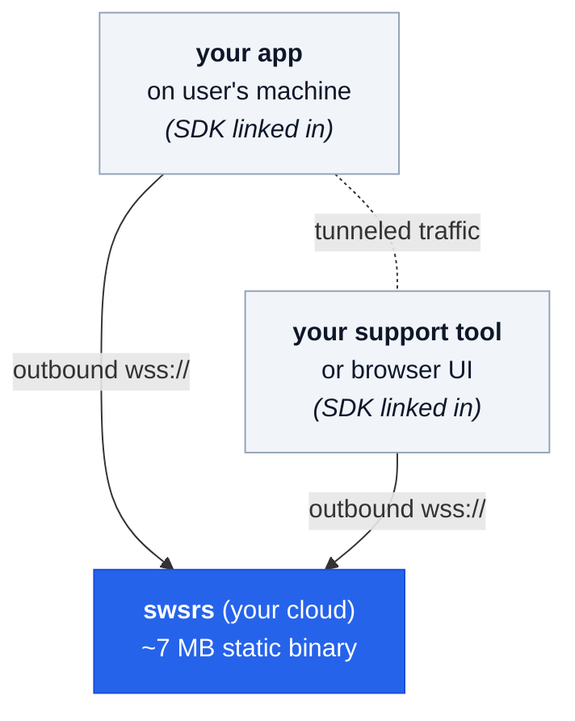
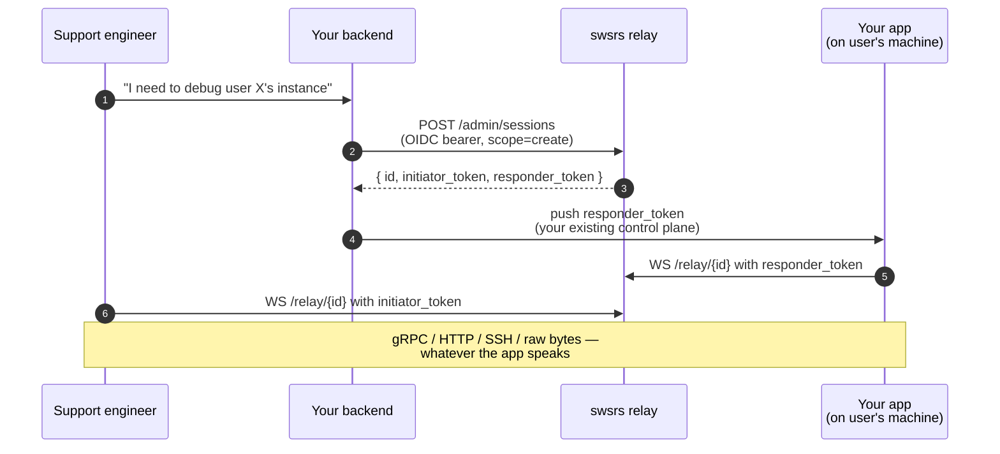

<style>
:root {
  --vp-home-hero-name-color: transparent;
  --vp-home-hero-name-background: -webkit-linear-gradient(120deg, #2563eb 30%, #06b6d4);
}
</style>

<div style="max-width: 960px; margin: 4rem auto 0; padding: 0 1.5rem;">

## What it's for

You ship an app — a desktop client, a CLI tool, a backend service, an embedded device — and you need a way to **reach into a specific instance running on a user's machine** to debug it, collect diagnostics, or open an interactive session. The usual options are bad:

- **VPN / port-forwarding:** asks users to configure networking they shouldn't have to think about.
- **"Install our debug agent":** another binary to ship, sign, update, and explain.
- **SaaS tunnel like ngrok:** routes your customers' data through someone else's infrastructure.

swsrs sits in the gap. **Your app already has the relay client linked in.** When you need to reach an instance, you mint a session, the app on the user's machine opens an outbound WebSocket to your relay, and you connect from your end. No new software on the user's machine, no firewall changes, no VPN, no third-party data path.



## Remote debugging your own app

The killer use case. Concretely:



Notice what's **not** on this diagram:

- A "swsrs CLI" running on the user's machine.
- A request to open ports on the user's firewall.
- A separate tunneling daemon to install and maintain.
- A third-party SaaS in the data path.

The user's machine has your app. Your app has the SDK. That's the whole story on the customer side.

## What makes it different

Most NAT-traversal tools either (a) skip auth or use a shared secret, (b) bundle a heavyweight gateway you can't fit on a `t4g.nano`, or (c) require a separate tunnel binary on every user's machine. swsrs sits in the intersection:

- **The party who can mint sessions is gated by your IdP** (OIDC, scope-claim).
- **The parties who actually use the tunnel are gated by short-lived per-slot tokens** — they need no IdP identity.
- **The server never inspects payloads** — it forwards opaque frames. Your app decides the protocol.
- **The peer logic is library code, not a separate process.** Link it into the app you're already shipping.

[See the full comparison →](/guide/comparison)

## Try it

```bash
# Run the relay locally with auth disabled (dev only)
go run github.com/emdzej/swsrs/cmd/swsrs@latest serve --no-auth --addr :8080

# In another terminal — end-to-end chat over the relay
bash scripts/smoke-chat.sh
# [smoke] PASS
```

For production: pick an IdP, point `--oidc-issuer` at it, and your clients run `swsrs auth` once. [Step-by-step setup for Keycloak / Auth0 →](/guide/idp/)

</div>
