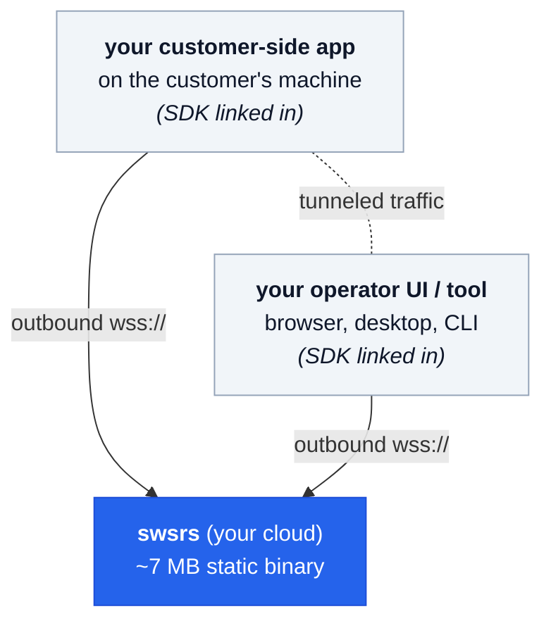
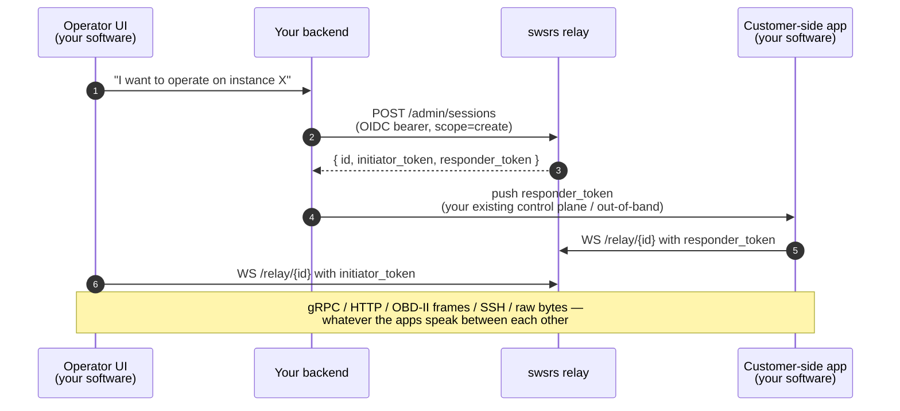

<style>
:root {
  --vp-home-hero-name-color: transparent;
  --vp-home-hero-name-background: -webkit-linear-gradient(120deg, #2563eb 30%, #06b6d4);
}
</style>

<div style="max-width: 960px; margin: 4rem auto 0; padding: 0 1.5rem;">

## What it's for

You sell software that needs to **reach instances of itself running on customers' machines**. You don't control their network. They can't (or shouldn't have to) expose ports. The usual answers all push the cost onto the customer:

- **VPN / port-forwarding:** asks customers to configure networking they shouldn't have to think about.
- **"Install our agent":** another binary to ship, sign, update, and explain.
- **SaaS tunnel like ngrok:** routes your customers' data through someone else's infrastructure.

swsrs sits in the gap. **Your customer-side app already has the relay client linked in** — it's the same SDK you'd link in for any other library. When you need to reach an instance, the customer's app opens a session and hands you a token; your operator-side software connects. Nothing new on the customer's machine, no firewall changes, no VPN, no third-party data path.



## A concrete example

You sell BMW diagnostic and coding software. Picture the flow:

> An owner wants help reading fault codes or applying coding changes. They run the **diagnostic app** you provided — a small Go binary that talks to the ECU over OBD-II. The app calls into the swsrs SDK and creates a session. Your backend pushes the responder token to a more experienced specialist via your existing UX. The specialist opens your **operator UI** in the browser. It uses the swsrs SDK to connect as the initiator. The UI is now talking live to the ECU on the owner's actual car. The specialist reads adaptation values, writes coding changes, validates against real-time telemetry. Done, hang up, session closes.

This isn't hypothetical — it's the real shape of
[Bimmerz Connect](/guide/case-studies/bimmerz), the production swsrs
deployment that powers the [bimmerz.app](https://bimmerz.app) suite of
BMW apps.

What this is NOT:

- It is **not** "the customer installs our tunneling utility." They installed your tuning client. The relay is just a library inside it.
- It is **not** "we VPN into their network." There's no network access at all — only one specific WebSocket session, gated by a one-time token.
- It is **not** "our data goes through a SaaS." The relay is yours; the data path is yours.

Swap "ECU tuning" for any of:

- **Hardware tuning / configuration** — printers, drones, audio interfaces, embedded controllers.
- **Software activation / installation walkthroughs** — interactive setup of complex on-prem deployments.
- **Live diagnostics / support** — pulling logs, profiling, attaching a debugger to a deployed service.
- **Remote pair-operation** — two operators acting on the same instance.
- **Field-engineer-to-deployed-device** — IoT or industrial gear in a customer site.

Same shape every time: a piece of your software on the customer side, a piece of your software on the operator side, a private rendezvous between them.

## How it actually wires up



Notice what's **not** on this diagram:

- A "swsrs CLI" running on the customer's machine.
- A request to open ports on the customer's firewall.
- A separate tunneling daemon to install and maintain.
- A third-party SaaS in the data path.

The customer's machine has your app. Your app has the SDK. That's the whole story on the customer side.

## What makes it different

Most NAT-traversal tools either (a) skip auth or use a shared secret, (b) bundle a heavyweight gateway you can't fit on a `t4g.nano`, or (c) require a separate tunnel binary on every user's machine. swsrs sits in the intersection:

- **The party who can mint sessions is gated by your IdP** (OIDC, scope-claim).
- **The parties who actually use the tunnel are gated by short-lived per-slot tokens** — they need no IdP identity.
- **The server never inspects payloads** — it forwards opaque frames. Your app decides the protocol.
- **The peer logic is library code, not a separate process.** Link it into the app you're already shipping.

[See the full comparison →](/guide/comparison)

## Try it

```bash
# Run the relay locally with auth disabled (dev only)
go run github.com/emdzej/swsrs/cmd/swsrs@latest serve --no-auth --addr :8080

# In another terminal — end-to-end chat over the relay
bash scripts/smoke-chat.sh
# [smoke] PASS
```

For production: pick an IdP, point `--oidc-issuer` at it, and your clients run `swsrs auth` once. [Step-by-step setup for Keycloak / Auth0 →](/guide/idp/)

## In production

<div style="border:1px solid var(--vp-c-divider); border-radius:12px; padding:1.25rem 1.5rem; margin:1.5rem 0;">

**Bimmerz Connect** — the relay behind [bimmerz.app](https://bimmerz.app)'s
BMW diagnostic and coding suite. Owners run a diagnostic app at home
plugged into their car; experienced users connect remotely from a web
UI and work on the live ECU. Single-instance swsrs against Keycloak,
running on a small EC2 instance behind Cloudflare.

[Read the case study →](/guide/case-studies/bimmerz)

</div>

*Using swsrs in production? [Open an issue](https://github.com/emdzej/swsrs/issues) — happy to feature you here.*

</div>
